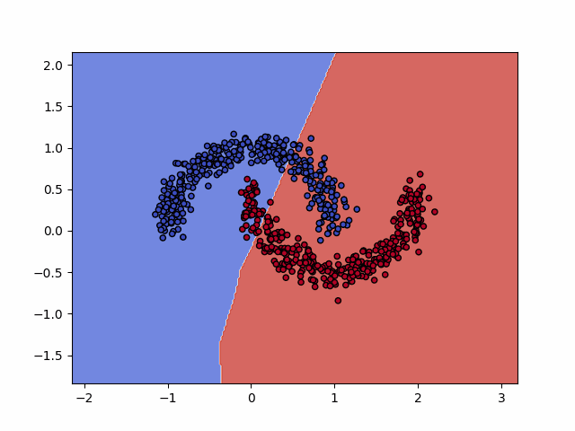
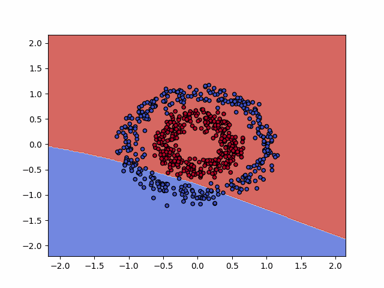
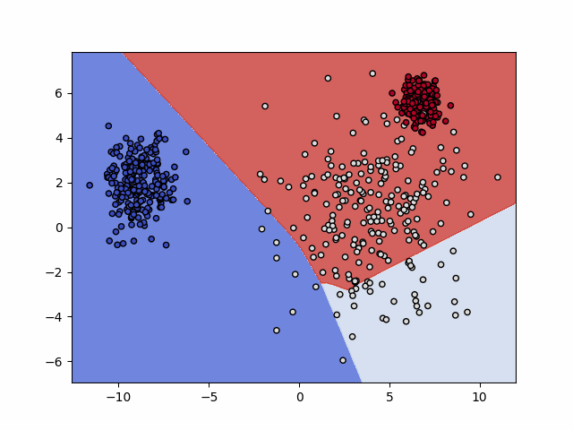
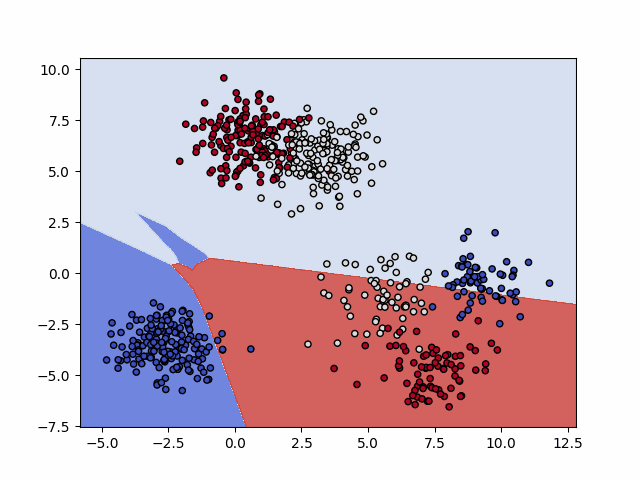
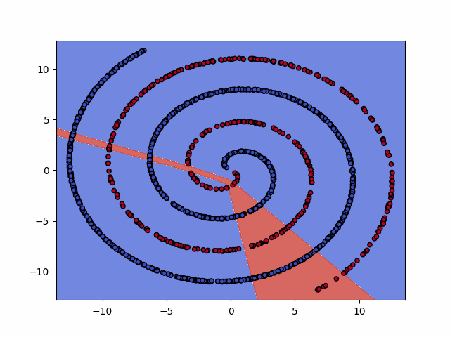

# mesh-neural-networks

This is the repository for the paper [Formal derivation of Mesh Neural Networks with their Forward-Only gradient Propagation](https://arxiv.org/abs/1905.06684) that is currently under peer review.

|  |  |
| --- | --- |
|    |  |

_All the above examples uses 5 hidden neurons_

_Spirals solved with 15 neurons_

As preliminary experiments we have tested our model against some toy datasets:
* [2D Notebook](https://nbviewer.jupyter.org/github/galatolofederico/mesh-neural-networks/blob/master/examples/2D%20Mesh%20Neural%20Network.ipynb)
* [Iris Notebook](https://nbviewer.jupyter.org/github/galatolofederico/mesh-neural-networks/blob/master/examples/Iris%20Mesh%20Neural%20Network.ipynb)

The code is intentionally left unoptimized in order to be coherent with the mathematical framework presented on the paper.

An optimized version is currently under development.

For any further question you can find me at [federico.galatolo@ing.unipi.it](mailto:federico.galatolo@ing.unipi.it) or on Telegram at [@galatolo](https://t.me/galatolo)